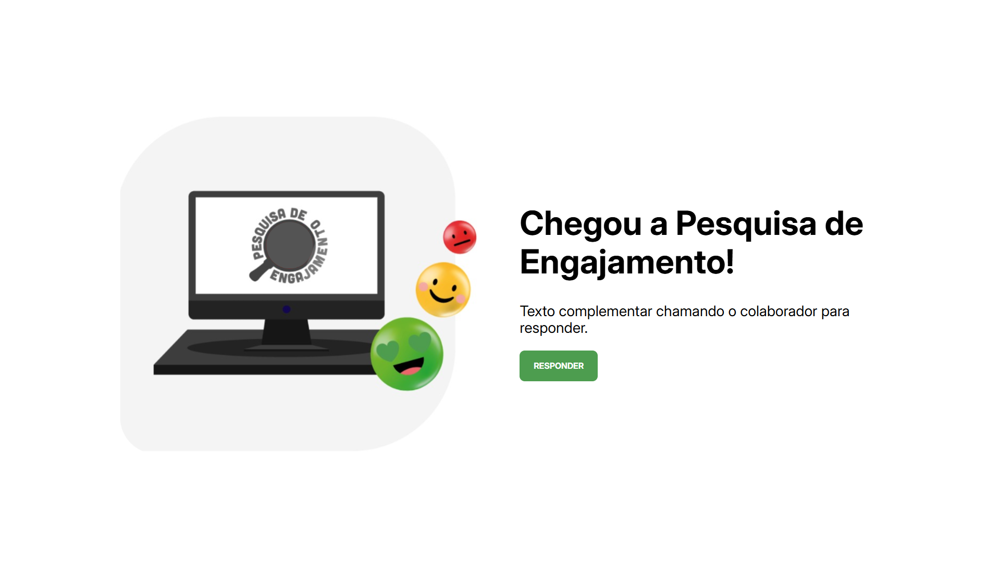

# Aplicação de Pesquisa de Engajamento


Uma aplicação web full-stack desenvolvida para fins de estudo, que permite aos usuários responderem a um questionário de engajamento. As respostas são salvas em um banco de dados e os resultados podem ser visualizados.

## 📸 Screenshot

;

## ✨ Funcionalidades

* **Questionário Interativo:** As perguntas são exibidas uma a uma para focar a atenção do usuário.
* **Navegação Intuitiva:** Botões para avançar e voltar entre as perguntas.
* **Validação:** O botão de avançar só é habilitado após uma resposta ser selecionada.
* **Envio e Persistência de Dados:** As respostas são formatadas e enviadas para uma API REST, que as armazena em um banco de dados MySQL.
* **Visualização de Resultados:** Uma página final exibe um resumo das perguntas e das respostas enviadas.

## 🛠️ Tecnologias Utilizadas

Este projeto foi construído utilizando uma arquitetura moderna com separação clara entre o front-end e o back-end.

#### **Front-end:**
* **[React](https://reactjs.org/)**: Biblioteca para a construção da interface de usuário.
* **[Styled Components](https://styled-components.com/)**: Para estilização dos componentes de forma isolada e dinâmica.
* **[React Router DOM](https://reactrouter.com/)**: Para gerenciamento de rotas na aplicação.
* **[Axios](https://axios-http.com/)**: Para realizar as requisições HTTP para a API.
* **Context API + Hooks**: Para gerenciamento de estado global de forma centralizada.

#### **Back-end (API):**
* **[Node.js](https://nodejs.org/)**: Ambiente de execução para o JavaScript no servidor.
* **[Express.js](https://expressjs.com/)**: Framework para a construção da API REST.
* **[MySQL2](https://github.com/sidorares/node-mysql2)**: Driver para a conexão com o banco de dados MySQL.
* **[CORS](https://expressjs.com/en/resources/middleware/cors.html)**: Para permitir requisições entre o front-end e o back-end.
* **[Dotenv](https://github.com/motdotla/dotenv)**: Para gerenciamento de variáveis de ambiente e proteção de dados sensíveis.

#### **Banco de Dados:**
* **[MySQL](https://www.mysql.com/)**

---

## 🚀 Como Executar o Projeto Localmente

Siga os passos abaixo para configurar e rodar a aplicação na sua máquina.

### **Pré-requisitos**

Antes de começar, você vai precisar ter as seguintes ferramentas instaladas:
* [Node.js](https://nodejs.org/en/)
* [Git](https://git-scm.com)
* Um servidor MySQL rodando localmente (ex: [XAMPP](https://www.apachefriends.org/index.html), [WAMP](https://www.wampserver.com/), [MySQL Community Server](https://dev.mysql.com/downloads/mysql/)).

### **1. Clone o Repositório**

```bash
git clone [https://github.com/](https://github.com/)Pauloglhr/pesquisa-engajamento.git
cd pesquisa-engajamento
```

### **2. Configure o Back-end (API)**

```bash
# Navegue até a pasta da API
cd api

# Instale as dependências
npm install

# Crie uma cópia do arquivo de exemplo de variáveis de ambiente
cp .env.example .env
```
Agora, abra o arquivo `api/.env` que você acabou de criar e preencha com as suas credenciais do banco de dados MySQL.

### **3. Configure o Front-end**

```bash
# Volte para a raiz e navegue até a pasta do front-end
cd ../front-end

# Instale as dependências
npm install

# Crie uma cópia do arquivo de exemplo de variáveis de ambiente
cp .env.example .env
```
O arquivo `front-end/.env` já deve estar configurado para se conectar à sua API local (`http://localhost:3000/questionario`).

### **4. Configure o Banco de Dados**

1.  Acesse seu gerenciador de banco de dados MySQL.
2.  Crie um novo banco de dados (schema) com o mesmo nome que você definiu em `api/.env`.

### **5. Execute a Aplicação**

Você precisará de **dois terminais** abertos simultaneamente.

**No Terminal 1 (para rodar a API):**
```bash
# A partir da raiz do projeto
cd api
node ./index.js
```
> Sua API estará rodando em `http://localhost:3000` (ou a porta que você definiu).

**No Terminal 2 (para rodar o Front-end):**
```bash
# A partir da raiz do projeto
cd fron-tend
npm run dev
```
> Sua aplicação React estará acessível em `http://localhost:5173`.

---
Feito por **Paulo Torres**.

[](https://www.linkedin.com/in/dev-torres/)
[](https://github.com/pauloglhr)